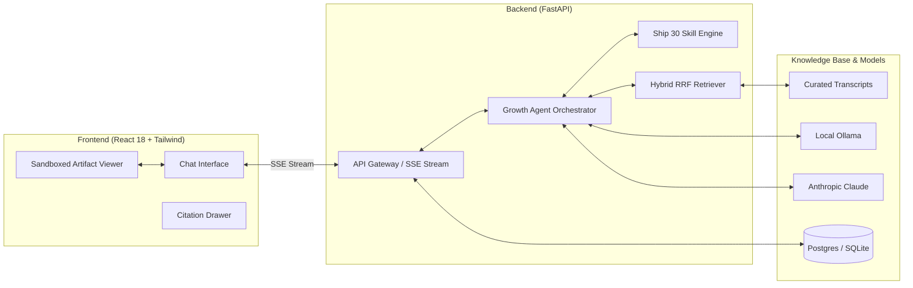

# 🚀 The Lenny Growth Assistant
> **A Production-Grade Full-Stack AI Product Assistant Grounded in Lenny's Podcast Transcripts**  
> *Built as a Forward Deployed Engineering assignment with multi-model local/cloud inference, high-precision Hybrid RAG, Ship 30 for 30 atomic essay generation, and a Claude-style sandboxed artifact viewer.*

[](https://fastapi.tiangolo.com)
[](https://react.dev)
[](https://ollama.com)
[](https://github.com/pgvector/pgvector)
[](https://opensource.org/licenses/MIT)

---

## 🌟 Executive Overview & Forward Deployment Context

**The Lenny Growth Assistant** solves the core pain point of product, growth, and venture teams: extracting verified, authoritative playbooks from hundreds of hours of [Lenny's Podcast transcripts](https://github.com/ChatPRD/lennys-podcast-transcripts) without hallucinations or prompt engineering friction.

### Core Capabilities:
1. **Source-Grounded Conversational Intelligence**: Hybrid RAG (Dense Cosine Vectors + BM25 Sparse Keyword Ranking via Reciprocal Rank Fusion) delivers exact citations (Episode title, Guest, Timestamp, Quote).
2. **Ship 30 for 30 Content Engine**: Automatically synthesizes grounded operator insights into ~1,250-word Atomic Essays following Nicolas Cole & Dickie Bush principles (1-3-1 cadence, bold visual anchors, high-leverage takeaways).
3. **Claude-Style In-App Artifact Viewer**: Renders interactive HTML/CSS/JS applications (calculators, SPADE decision matrices, PLG funnels) side-by-side with chat in a secure, isolated sandbox (`sandbox="allow-scripts"` without `allow-same-origin`).
4. **Flexible Multi-Model Routing**: Seamless toggle between **Local Ollama** (`llama3.2`, `mistral`, `deepseek-r1`), **Anthropic Claude** (`claude-3-7-sonnet`), **OpenAI** (`gpt-4o`), and a **Deterministic Demo Mode**.

---

## 🏗️ System Architecture



---

## ⚡ Quickstart (Zero-Dependency Local Run)

### Option 1: One-Command Startup (Native Python/Node)
```bash
# 1. Clone repository
git clone https://github.com/your-username/lenny-growth-assistant.git
cd lenny-growth-assistant

# 2. Run backend & tests (automatic SQLite + Demo Engine ready out-of-the-box)
./run.sh
```
- **Backend API & Swagger Docs:** [http://localhost:8000/docs](http://localhost:8000/docs)
- **Health Check:** [http://localhost:8000/healthz](http://localhost:8000/healthz)

### Option 2: Full-Stack Docker Compose (1-Command Enterprise Setup)
```bash
# Starts PostgreSQL (pgvector), Ollama, FastAPI Backend, and React Frontend
docker compose up --build -d
```
- **Frontend App:** [http://localhost:3000](http://localhost:3000)
- **Backend API:** [http://localhost:8000](http://localhost:8000)

---

## 🦙 Local LLM Setup (Ollama — Mandatory for Demo)

1. **Install and start Ollama**:
   ```bash
   brew install ollama
   ollama serve
   ```
2. **Pull the recommended model**:
   ```bash
   ollama pull llama3.2
   ```
3. **Configure in `.env`**:
   ```env
   DEFAULT_PROVIDER=ollama
   OLLAMA_BASE_URL=http://localhost:11434
   OLLAMA_MODEL=llama3.2
   ```
4. In the UI navbar, select **"Ollama (Local LLM)"** to chat with 100% offline local inference.

---

## ☁️ Cloud LLM Setup (Anthropic & OpenAI)

To use Anthropic Claude 3.7/3.5 Sonnet or OpenAI GPT-4o:
1. Add your API key to `.env`:
   ```env
   ANTHROPIC_API_KEY=sk-ant-api03-...
   OPENAI_API_KEY=sk-proj-...
   ```
2. Select **"Anthropic Claude"** or **"OpenAI GPT-4o"** in the UI top dropdown. The backend dynamically routes requests without requiring server restarts.

---

## 🧪 Automated & Manual Testing

### Automated Test Suite (Pytest / Unittest)
```bash
cd backend
python3 -m unittest discover -s tests
```
**Test Coverage Includes:**
- ✅ Health & Readiness probes (`/healthz`, `/readyz`)
- ✅ Model registry & connectivity inspection
- ✅ Hybrid RAG reciprocal rank fusion (RRF) on Brian Chesky, Elena Verna, Shreyas Doshi, and Gokul Rajaram
- ✅ Grounding guardrails & citation metadata schema
- ✅ Ship 30 for 30 essay structure & prompt extraction
- ✅ Artifact HTML security sanitization (`javascript:` and `cookie` stripping)
- ✅ Multi-session CRUD lifecycle & message persistence

### Manual Evaluation Test Plan:
1. **Grounding Test**: Ask *"How does Brian Chesky view product management vs typical founders?"*
   - Verify: Response includes bracketed citations `[^1]`. Clicking citation opens drawer with episode title and timestamped quote.
2. **Ship 30 Essay Test**: Click **"Draft Ship 30 Essay"** on any response.
   - Verify: System generates a ~1,250-word atomic essay with 1-3-1 cadence and opens it in the artifact pane.
3. **Interactive Artifact Test**: Ask *"Generate an interactive SPADE decision matrix calculator in HTML/CSS."*
   - Verify: Side-by-side artifact viewer opens and renders the live interactive calculator widget inside the secure iframe.
4. **Out-of-Scope Test**: Ask *"Who won the 1994 Super Bowl?"*
   - Verify: Assistant cleanly refuses: *"The available Lenny's Podcast transcripts do not contain information on this topic."*

---

## 🔒 Security & Artifact Isolation Model

| Threat Vector | Mitigation |
| :--- | :--- |
| **XSS / Cookie Exfiltration in Artifacts** | `iframe` rendered with `sandbox="allow-scripts"` (strictly NO `allow-same-origin`), blocking access to `window.parent`, `localStorage`, and `document.cookie`. |
| **Malicious Scripts & Protocol Injections** | Backend regex & DOMPurify sanitizer strips `javascript:` and `data:` URIs. |
| **Network Leakage from Artifacts** | Strict Content-Security-Policy (CSP) headers injected into `srcDoc` (`default-src 'none'; script-src 'unsafe-inline' https://cdn.jsdelivr.net`). |

---

## 📂 Repository Structure

```
lenny-growth-assistant/
├── backend/
│   ├── app/
│   │   ├── api/v1/          # Chat, Sessions, Artifacts, Models, Health
│   │   ├── core/            # Config, JSON Logger, Security Sanitizer
│   │   ├── db/              # SQLAlchemy Models & Universal DB Engine
│   │   ├── providers/       # Ollama, Anthropic, OpenAI, Mock
│   │   ├── rag/             # Chunker, Embeddings, Hybrid RRF Retriever, Ingest
│   │   ├── skills/          # Ship 30 Essay, Artifact Builder, Grounding Guard
│   │   ├── agents/          # Growth Agent Dispatcher & Prompts
│   │   └── main.py          # FastAPI Application
│   ├── data/transcripts/    # 9 Curated Lenny's Podcast Episodes
│   └── tests/               # Backend Unit & Integration Tests
├── frontend/
│   ├── src/
│   │   ├── components/      # ChatArea, ArtifactViewer, SandboxedIframe, Sidebar, ModelSelector
│   │   ├── hooks/           # useChat, useSessions
│   │   ├── services/        # Typed API Client
│   │   └── App.tsx          # Main Application
│   ├── package.json
│   └── vite.config.ts
├── agent_transcripts/       # Coding Agent Execution Traces & Logs
├── PRD.md                   # Forward Deployment Brief & PRD
├── design.md                # UI/UX & Design System Specification
├── architecture.md          # Full Technical Architecture & DB ERD
├── demo_script.md           # 2-3 Minute Video Recording Script
├── docker-compose.yml       # 1-Command Multi-Container Deployment
└── run.sh                   # Local Quickstart Script
```

---

## 🤝 Forward Deployed Engineer Handoff

### How an engineering team can extend this:
1. **Adding New Transcripts**: Drop new `.md` transcript files into `backend/data/transcripts/` and run `make ingest` or POST `/api/v1/chat` (auto-ingests on startup).
2. **Adding a New Domain Skill**: Create a new class in `backend/app/skills/` adhering to the prompt contract and register it in `backend/app/agents/growth_agent.py`.
3. **Connecting Enterprise Vector Store**: Update `DATABASE_URL` in `.env` to point to Supabase, Railway, or AWS RDS PostgreSQL with `pgvector`.
