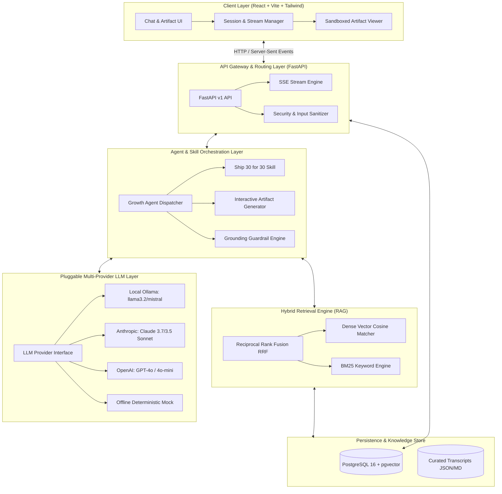
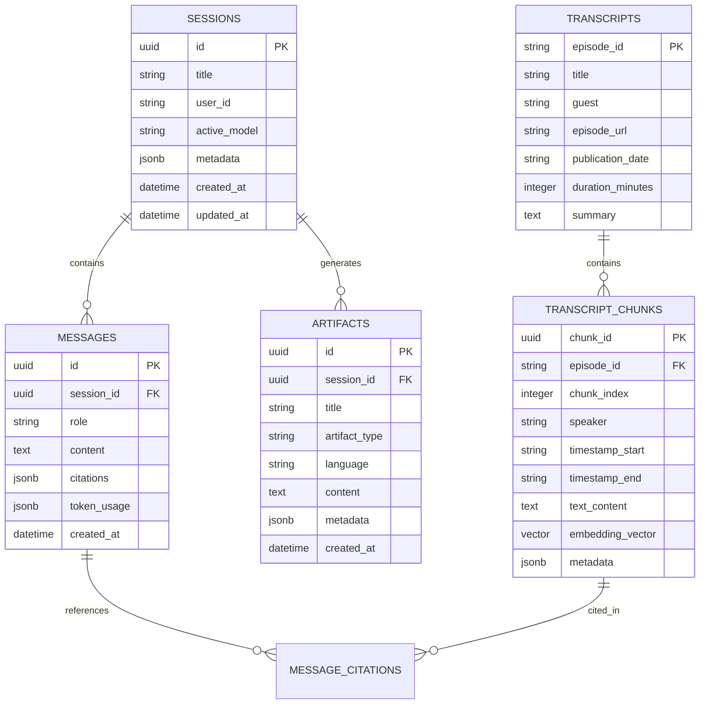

# System Architecture & Technical Specification
## The Lenny Growth Assistant

---

## 1. System Topology Overview

The Lenny Growth Assistant is organized as a decoupled, multi-tier cloud-native architecture optimized for sub-second retrieval latency, robust grounding, and secure in-browser artifact rendering.



---

## 2. Database Schema & Data Models

The persistence layer is managed via async SQLAlchemy supporting both **PostgreSQL (with `pgvector`)** and zero-dependency **SQLite** (with JSON vector storage).



---

## 3. Ingestion & Hybrid Retrieval Pipeline

To ensure high-precision grounding without hallucinations, the retrieval pipeline leverages a **Hybrid Reciprocal Rank Fusion (RRF)** approach:

1. **Ingestion & Chunking**:
   - Transcripts are parsed into semantic chunks of ~400-600 tokens with 80-token sliding overlap.
   - Speaker diarization markers (`[Lenny Rachitsky]`, `[Elena Verna]`) and timestamps are preserved in each chunk.
   - Dense embeddings (384-dim or 1536-dim) are pre-calculated and indexed.
2. **Hybrid Search (Dense + Sparse)**:
   - **Dense Search**: Cosine similarity against chunk vector embeddings.
   - **Sparse Search**: BM25 keyword matching with term frequency & inverse document frequency.
3. **Reciprocal Rank Fusion (RRF)**:
   $$\text{RRF Score}(d) = \sum_{m \in \{\text{dense}, \text{bm25}\}} \frac{1}{k + \text{rank}_m(d)} \quad (k=60)$$
   - The top $K=5$ chunks are ranked, deduplicated by episode, and injected into the LLM grounding context.

---

## 4. Multi-Provider LLM Abstraction & Fallback Engine

The LLM abstraction allows dynamic runtime switching without restarts:

```python
class BaseLLMProvider(ABC):
    @abstractmethod
    async def generate_stream(
        self, 
        messages: List[ChatMessage], 
        system_prompt: str,
        temperature: float = 0.2
    ) -> AsyncGenerator[StreamChunk, None]: ...
    
    @abstractmethod
    async def check_health(self) -> ProviderHealthStatus: ...
```

### Fallback State Machine
1. User requests a model (`ollama/llama3.2`, `anthropic/claude-3-7-sonnet`, `openai/gpt-4o`).
2. If the target provider is unreachable or missing API credentials:
   - System catches the specific `ProviderUnreachableException`.
   - Emits a structured SSE event warning the client.
   - Auto-falls back to the next available healthy provider (e.g. Local Mock Demo or available Cloud).

---

## 5. Artifact Rendering & Security Isolation Model

Artifacts allow the assistant to generate interactive HTML/CSS/JS applications (calculators, funnels, dashboards) and Markdown documents rendered natively beside the chat.

### Security Threat Modeling & Isolation
- **Threat**: User or model-generated HTML contains malicious JavaScript targeting session storage, cookies, or XSS against the parent window.
- **Defense Mechanism**:
  1. **Dual-Sanitization**: Backend validates syntax and strips `data:`, `javascript:` URI schemes.
  2. **Iframe Sandboxing**: Rendered exclusively in `<iframe sandbox="allow-scripts" />`.
  3. **No `allow-same-origin`**: Prevents the iframe script from accessing `window.parent`, `localStorage`, `sessionStorage`, or cookies.
  4. **Content-Security-Policy (CSP)** injected into `srcDoc`:
     ```html
     <meta http-equiv="Content-Security-Policy" 
           content="default-src 'self' 'unsafe-inline' https://cdn.jsdelivr.net https://cdnjs.cloudflare.com; script-src 'unsafe-inline' 'unsafe-eval' https://cdn.jsdelivr.net; style-src 'unsafe-inline' https://cdn.jsdelivr.net https://fonts.googleapis.com;">
     ```

---

## 6. API Endpoint Contracts

| Method | Endpoint | Description | Request / Response |
| :--- | :--- | :--- | :--- |
| `POST` | `/api/v1/chat` | Main SSE Streaming Chat endpoint | `ChatRequest` $\to$ SSE `data: {"type": "token" \| "citation" \| "artifact"}` |
| `GET` | `/api/v1/sessions` | List all user chat sessions | Response: `List[SessionSummary]` |
| `POST` | `/api/v1/sessions` | Create a new session | `CreateSessionRequest` $\to$ `SessionDetail` |
| `GET` | `/api/v1/sessions/{id}` | Get session details & messages | Response: `SessionDetail` |
| `DELETE`| `/api/v1/sessions/{id}` | Delete a session & messages | Response: `{"status": "deleted"}` |
| `GET` | `/api/v1/artifacts/{id}`| Fetch artifact content & metadata | Response: `ArtifactResponse` |
| `GET` | `/api/v1/models` | List available providers & live status | Response: `List[ModelStatus]` |
| `POST` | `/api/v1/skills/ship30` | Direct Ship 30 for 30 essay generator | `Ship30Request` $\to$ `ArtifactResponse` |
| `GET` | `/healthz` | Kubernetes Liveness Probe | Response: `{"status": "healthy"}` |
| `GET` | `/readyz` | Kubernetes Readiness Probe (DB + LLM) | Response: `{"status": "ready", "checks": {...}}` |

---

## 7. Deployment Topology

The system is packaged with a single-command `docker-compose.yml` defining 4 isolated services:
1. **`frontend`**: React 18 / Vite static build served with Nginx.
2. **`backend`**: FastAPI ASGI server with Uvicorn (4 worker processes).
3. **`postgres`**: PostgreSQL 16 with `pgvector` extension enabled.
4. **`ollama`**: Local Ollama container serving downloaded LLM weights.
